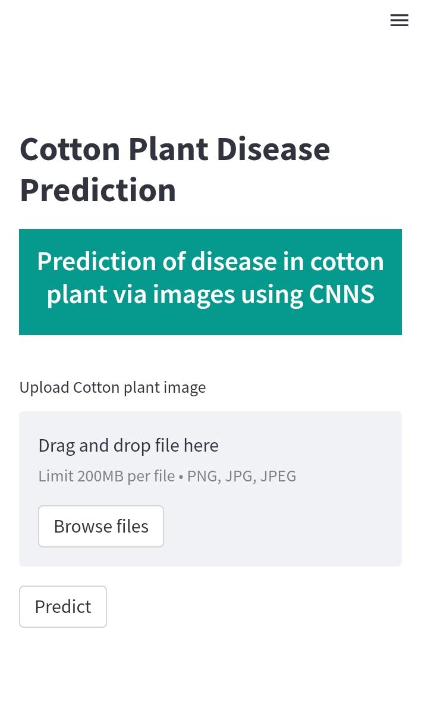
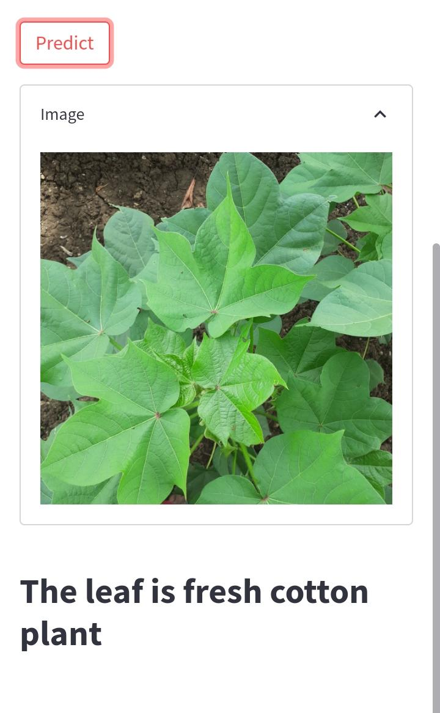

# Cotton_Plant_Disease
A project on the classification of cotton plant images mainly into four categories using CNNs
 <ul>
    <li>Diseased Cotton Leaf</li>
    <li>Diseased Cotton Plant</li>
    <li>fresh Cotton Leaf</li>
    <li>fresh Cotton Plant</li>
 </ul>
 

  
  

### Web App deployment: https://sushmita10062002-cotton-plant-disease-streamlitapp-tzi7ww.streamlitapp.com/
